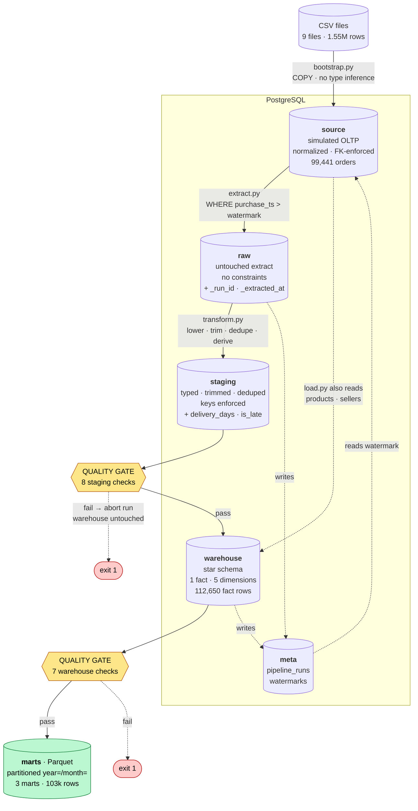
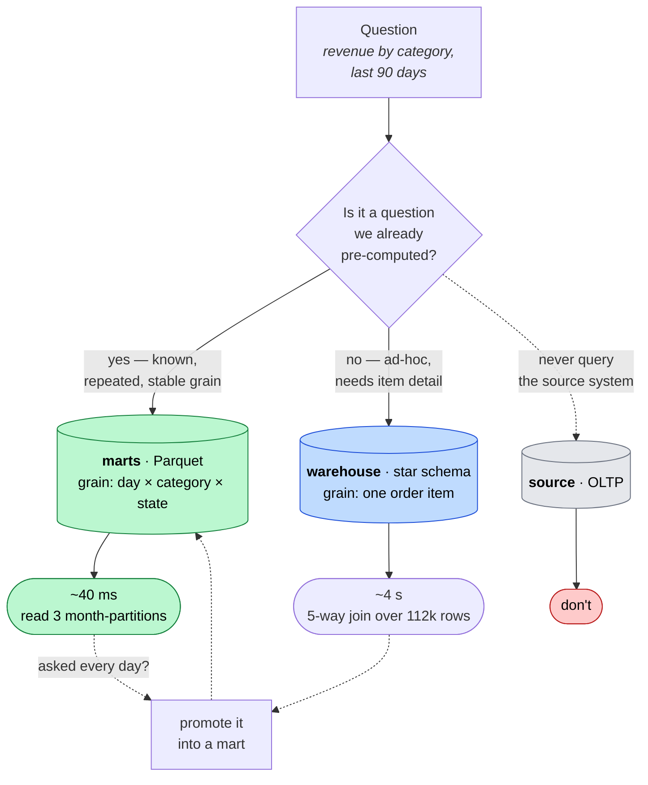
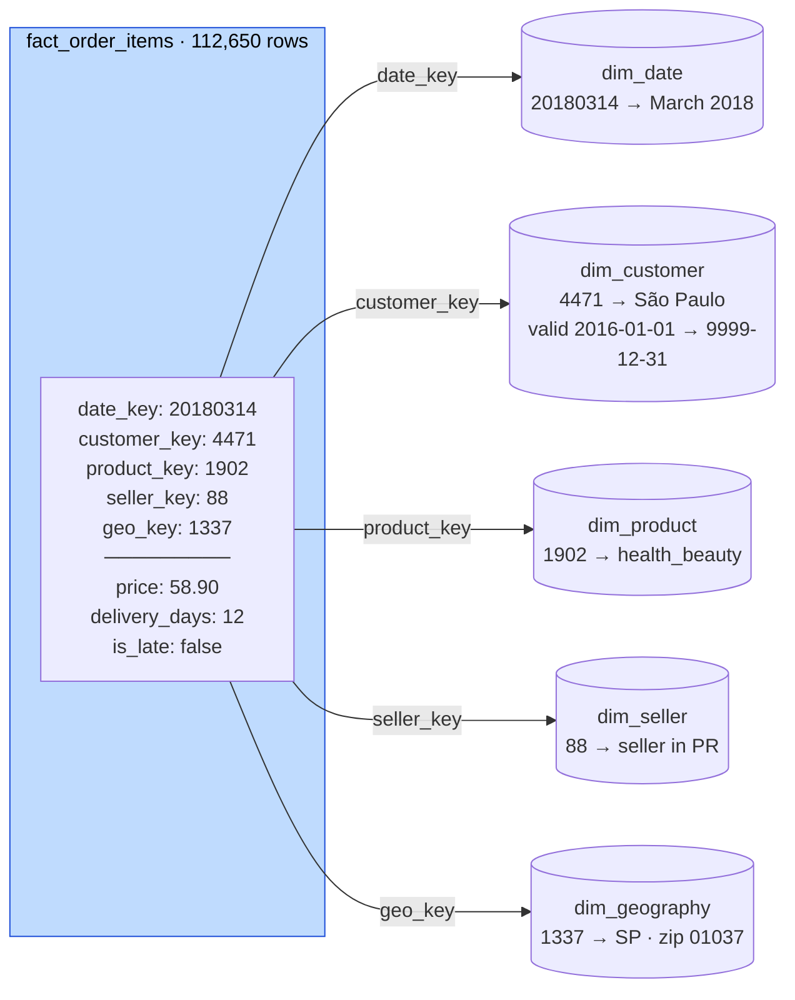
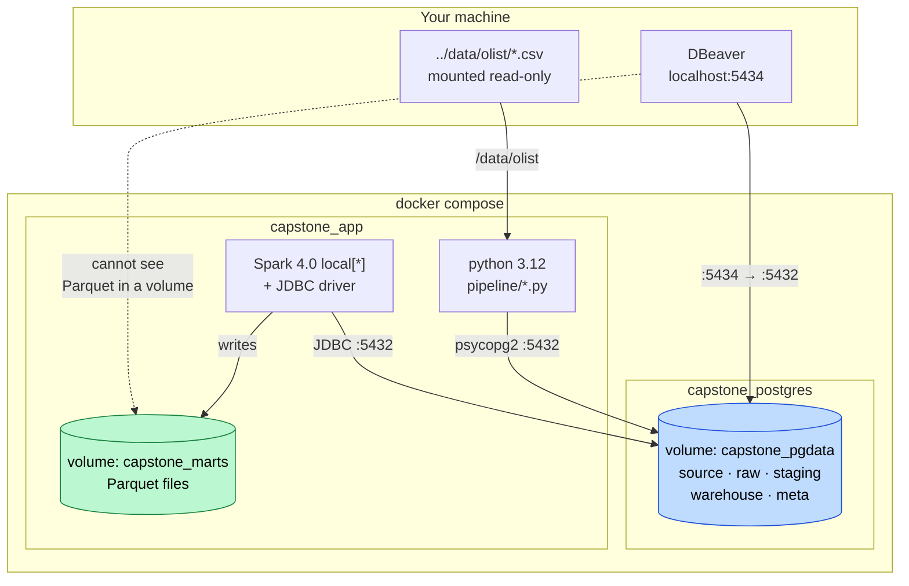

# Data flow — write path and read path

Two separate journeys. Data is **written** once a night through five layers;
a question is **read** back through whichever layer can answer it fastest.

---

## 1. The write path — how data moves



**What each arrow costs**

| Step | Bounded by | Rows moved (2nd run) |
|---|---|---|
| `bootstrap` | one-off | 1,550,922 |
| `extract` | **watermark** | 54,011 — only new orders |
| `transform` | whole table | 112,650 — upserts, so safe but not cheap |
| `load` | whole table | 112,650 — same |
| `build_marts` | whole warehouse | 112,650 → 103,513 aggregated |

Only `extract` is incremental. Everything downstream re-processes and
upserts, which is why re-running is safe and why the run time does not
shrink on a small delta.

---

## 2. The read path — how a query gets answered



### Which layer answers what

| Question | Layer | Why |
|---|---|---|
| "Revenue by category, last 90 days" | **mart** | Pre-aggregated at exactly that grain |
| "7-day rolling average for health_beauty in SP" | **mart** | Already computed at write time |
| "Average order value — fewer orders or smaller ones?" | **warehouse** | Needs item-level detail the mart discarded |
| "What did customer X buy on 14 March?" | **warehouse** | Atomic grain |
| "Which orders have no payment row?" | **source** | Operational question, not analytical |

The asymmetry that drives the whole design: **you can always compute the mart
from the warehouse; you can never recover the warehouse from the mart.**
Aggregation is lossy and one-directional.

---

## 3. Inside a warehouse query — how a fact row finds its context



The fact row holds **keys and numbers only** — no city name, no category
text. One join per dimension retrieves the context. That is what keeps the
fact table narrow enough to scan quickly, and why the same question against
`source` needed five joins through foreign keys designed for transactions
rather than analysis.

```sql
-- the whole star, in one query
select d.month_name, p.category_en, g.state, sum(f.price) as revenue
from warehouse.fact_order_items f
join warehouse.dim_date      d on d.date_key    = f.date_key
join warehouse.dim_product   p on p.product_key = f.product_key
join warehouse.dim_geography g on g.geo_key     = f.geo_key
where d.year = 2018
group by 1, 2, 3;
```

**SCD Type 2 note:** `customer_key` points at the version of the customer
that was current *when the order was placed*, not the version current today.
That is why a 2017 order still reports the city it actually shipped to after
the customer moves.

---

## 4. Where each piece physically lives



DBeaver reaches everything in Postgres on port 5434, but **not** the marts —
those are Parquet files inside a Docker volume. Inspect them from the
container, or switch the volume to a bind mount (`./marts:/app/marts`) to
see them on disk.
